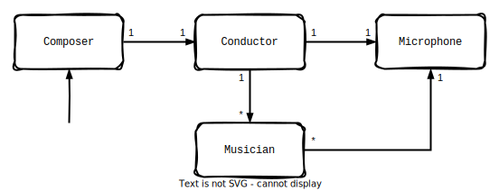

+++
title = "More Actors with Tokio"
date = 2025-02-19
+++

In spring 2021, when I was first submerging into [tokio](https://tokio.rs), a colleague and friend mentioned I should ingest this article:
[Actors with Tokio](https://ryhl.io/blog/actors-with-tokio/) by Alice Ryhl.
And, did I ingest it.
To summarize, the article proposes an architectural style which relies on
message passing (channels) and
inherent parallelism (tasks)
as well as
concurrency (via `async/.await`)
to neatly and safely structure applications dealing with I/O.
But really, [go read the article](https://ryhl.io/blog/actors-with-tokio/).

Alice's post shaped and will continue to shape the asynchronous designs I take part in.
Unsurprisingly, I'm not the only one - everybody working with Rust in network applications and beyond seems to relate.

I have happily and successfully applied this "actor" architecture style over the last years.
Over this time, I have discovered a few minor adjustments to the proposed style for improved testability and composability.

> **_Note:_** It is recommended to have read the aforementioned article before reading this one. In fact, **if you're gonna read one article, [read Alice's article](https://ryhl.io/blog/actors-with-tokio/)**.

## I believe that an actor should *be* its data

Alice's post starts off with a recipe, briefly introducing the style by example.
Although the principle remains, I suggest a few changes.
In the original recipe, the actor holds its state _and its receiver_.
What if an actor consisted solely of its plain-old-data state?

```rust
#[derive(Debug, PartialEq, Eq)]
pub struct UniqueIdService {
    next_id: u32,
}
```

An actor should not own channel handles or sockets or other I/O resources.
It may require them as arguments for its event loop of course! But not hold them as members.
**Ownership is responsibility**, and who is really responsible for the run-time resources of the actor? The actor's event loop (see below).

> **_Note:_** Holding simple data as actor state also simplifies restarting an actor after it broke out of its event loop: all you have to do is create new runtime resources and start the event loop again.

## I prefer the Event Loop as _consuming method_

Somewhat differently to the original recipe, I prefer this particular event loop signature:

```rust
impl UniqueIdService {
    pub async fn event_loop(mut self, mut rx: mpsc::Receiver<Message>) -> Self {
        ...
    }
```

Notably, the event loop is a method _consuming and returning_ `Self`.
It can be spawned as a task, but _doesn't have to_.

By returning `Self`, we can inspect the state after the event loop finished, and even re-enter it.
And, we can assert that the correct target actor state has been reached in a [unit test](#simple-unit-test).

## I like to leave the spawning to the user

The original recipe [`tokio::spawn`](https://docs.rs/tokio/latest/tokio/task/fn.spawn.html)s the actor event loop in a helper function.
But who are we to assume that particular use? One may want to:

* await the end of the event loop (without spawning),
* spawn, then monitor the [`tokio::task::JoinHandle<_>`](https://docs.rs/tokio/latest/tokio/task/struct.JoinHandle.html),
* create the actor event loop future and put it in something like a [`FuturesUnordered`](https://docs.rs/futures/latest/futures/stream/struct.FuturesUnordered.html) along with its brethren, or
* spawn the event loop future on a non-tokio executor.

That's not to say you should not spawn the event loop onto some kind of task.
Spawning is great, and it lets an actor run free (employing parallelism) in its own little world (no foreign references, in or out).

## I don't believe in actor handles

The original recipe recommends to implement an actor handle type.
Perhaps surprisingly, I have stopped writing actor handle types!
In my opinion, actor handles paper too much over the operations on the channel handle to the actor.
I feel they obscure what is actually happening and prevent us from doing _cool shit_. We can't

* await the termination of the actor (unless we forward [`mpsc::Sender::closed`](https://docs.rs/tokio/latest/tokio/sync/mpsc/struct.Sender.html#method.closed) of the underlying sender handle)
* store the response futures (`oneshot::Receiver`s) in a combinator ([see unit test](#simple-unit-test)),
* use the actor handle from a blocking context,
* ... much more _cool shit_.

In short, [all the methods implemented on the `mpsc::Sender`](https://docs.rs/tokio/latest/tokio/sync/mpsc/struct.Sender.html) are there for good reasons, but our handle is hiding them.

My suggestion if you really want to reduce boilerplate anyway is to use associated functions on the actor (`UniqueIdService`) type:

```rust
/// Query for a unique id.
///
/// Returns `None` if the actor is not running.
pub async fn get_unique_id(sender: &mpsc::Sender<Message>) -> Option<oneshot::Receiver<u32>> {
    let (callback, callback_receiver) = oneshot::channel();
    let message = Message::GetUniqueId { callback };

    sender.send(message).await.ok()?;
    Some(callback_receiver)
}
```

I recommend to not fold in the `oneshot::Receiver` like in the original handle implementation!
By holding the receiver, you can collect and await it at your convenience.
For an example, see the [unit test](#simple-unit-test).

## <a href="#simple-unit-test" name="simple-unit-test"></a> Unit Testing the `UniqueIdService`

I have found that actors which aren't easy to test hint at bad architecture. The interfaces should be clear, and all the other parties an actor talks to _should not need to be mocked_:
the communication medium is some channel,
so one only needs to create such a channel and enqueue the correct messages on it (_before_ running the event loop, see below).

Care must be taken to not run into timing-dependent behaviour in a unit test (and **please avoid at great cost situations where you put a `sleep` call in your test! It reeks**.
There is no way to ensure real-time constraints within tokio naively, so **don't pretend there is** by bounding the execution time of your function under test).

The actor interface as-is enables us to write a test with a deterministic order of events,
because we don't need to spawn a task running your actor and then send messages to it.
Instead, we enqueue the messages, then _drop the sender_.
Only then, we await the event loop. Here we encounter "natural actor shutdown". We can assert on the resulting final state.

```rust
#[tokio::test]
async fn should_increment_unique_id() {
    let actor = UniqueIdService::new();
    let (tx, rx) = mpsc::channel(3);

    let resp1 = UniqueIdService::get_unique_id(&tx).await.unwrap();
    let resp2 = UniqueIdService::get_unique_id(&tx).await.unwrap();
    let resp3 = UniqueIdService::get_unique_id(&tx).await.unwrap();

    // Important for this test:
    drop(tx);

    let service = actor.event_loop(rx).await;

    let nums = tokio::try_join!(resp1, resp2, resp3).unwrap();
    assert_eq!(nums, (0, 1, 2));
    assert_eq!(service, UniqueIdService { next_id: 3 });
}
```

> **_Note_**: The event loop returns `Self`. This means, even if you do need to spawn it, `.await`ing the `tokio::task::JoinHandle<UniqueIdService>` yields your actor state.

> **_Note_**: One should generally, but especially in tests, await the completion of tasks somehow, if only to assert they did not panic. If you can, avoid placing asserts in test-only tasks.

[Full Example](https://play.rust-lang.org/?version=stable&mode=debug&edition=2021&gist=bb316eb8bf6ab51602bfaedb2a841e70)

# <a href="#bounded-mpsc-footgun" name="bounded-mpsc-footgun"></a>Ruling out Deadlocks with Bounded Channels

Attempting to send a message on a tokio bounded mpsc channel is `async`, because the channel might be filled to the bound.
In that case, sending will "suspend" until space becomes available.
This is great, because it introduces _backpressure_.

In normal operation, the mpsc queue compensates flow rate differences between sending and receiving.
However, imagine a situation where actor A sends actor B messages, while actor B sends actor A messages:


With both channels being bounded, the queue from A to B could become filled-to-the-bound.
Then, A would be blocked until B processes the next message, meaning A would process no messages.
If B now sends messages to A, they would not be processed, filling the channel to the bound.
Yikes! Deadlock.

This situation is bad in another way, _even if the deadlock never arises_.
The actor cycle prevents natural actor shutdown of A and B, because there always exists a handle to each receiver.
A and B are engaged in a sort of toxic nepotistic double binding.

> **_Note:_** Strive for your channel topology to be a **Directed Acyclic Graph** (see below).

## Message `enum`s are great

I have not changed a thing about the message type in the original recipe, because it's timeless.
Remember to make your messages own your data - don't borrow.

> **_Note_**: A message is a way to transfer ownership from one actor to another, thereby transferring the responsibility to handle the data. Borrowing indicates time-coupling of components, which would defeat the purpose of autonomously running actors, so don't do it. Don't worry, if you do it, you'll end in lifetime soup and back out, anyway.

> **_More Note_**: Sounds like a V-Table? [Not a coincidence](#ooop).

## On Call-and-Response

Most actors in my experience do not require and should not employ the call-response pattern demonstrated in this example. It's a sort of sync-async crossover anyway, and blocks the "calling" actor (when implemented naively). Look at the original post under the "No responses to messages" heading.**Most actors I have seen simply take "Commands", i.e. messages carrying the plain-old-data to be processed.**
The most fun designs I have been with did not use the pattern at all, and data flowed only left-to-right. This is good for a number of reasons, notably it [prevents the biggest footgun of bounded mpsc channels](#bounded-mpsc-footgun) and [facilitates automatic application shutdown](#automatic-application-shutdown).

## <a href="#automatic-application-shutdown" name="automatic-application-shutdown"></a>I like "Natural Actor Shutdown"

The actor scheme presented here still employs one of the most important aspects of the original design, which is "natural actor shutdown":

```rust
while let Some(message) = rx.recv().await {
    self.handle_message(message);
}
```

We exit when `recv`ing on the channel yields `None`.
As per [the docs](https://docs.rs/tokio/latest/tokio/sync/mpsc/struct.Receiver.html#method.recv), this happens when
there are no more messages in the `mpsc::Receiver` queue, **and**
there are no more `mpsc::Sender`s.
In this situation, all messages have been handled, and no more senders can ever be created.
After exiting the event loop, but before returning from the function, an actor may run asynchronous cleanup logic
(such as unsubscribing from a message broker or closing a websocket connection).
After cleaning up, the event loop shall [drop all runtime resources](#automatic-application-shutdown).
Other actors may then realize this situation and perform their own natural shutdown.

If your entire system topology is a DAG, you can achieve graceful shutdown by dropping the "top-level handle".



> **_Note:_** If the task was spawned and isn't being joined somewhere, all actor resources are dropped. This includes channel handles of other actors.

> **_More Note:_** Sounds like garbage collection? [Not a coincidence](#ooop).

### What about Explicit Shutdown?

An actor should generally detect the condition where it is no longer needed and shut down by breaking out of its event loop.
I prefer this over explicitly shutting down an actor.
Ideally, shutdown naturally happens gracefully when each actor finishes processing and drops its actor handles.
Some designs do require distributing a [`tokio_util::sync::CancellationToken`](https://docs.rs/tokio-util/latest/tokio_util/sync/struct.CancellationToken.html) among the components, though.

## There is no Rust Actor Framework, and it's called `tokio`

As a personal opinion of mine, and perhaps a spicy take: don't use an actor framework.
The ones I have seen are bad abstractions over `tokio::spawn` and overly restrictive.

## Don't make a `Heartbeat` Actor

If your actor has the sole purpose of periodically announcing itself to the world, something is wrong.
If all other actors in the system are stuck or bogged down slow, should that heartbeat actor still run free? No.

## The only thing better than an actor: no actor

If you can avoid an actor, do so. Try to delete as many actors from your design as possible.
Too many times I have observed that after an initial design, by deleting stuff from it, one can arrive at a beautiful final design.
If a region of your design doesn't feel right or look nice, **trust your gut**: try to find the root cause of the strangeness, then try to eliminate it.
You may, like me, uncover corners that are incidentally complex and can be fixed.
Refuse to start implementation until you understand the problem (mind the "unreasonable effectiveness of **understanding the problem**").

# <a href="#ooop" name="ooop"></a>"Original OOP" (OOOP)

Famously, Alan Kay "didn't have C++ in mind" when coining the term "OOP" (Object Oriented Programming).
This means inheritance, overloading, and a `class` keyword are completely besides the point!
But what _did_ he have in mind?

> OOP to me means only messaging, local retention and protection and hiding of state-process, and extreme late-binding of all things.
>
> <cite>Alan Kay</cite> in [Dr. Alan Kay on the Meaning of “Object-Oriented Programming”](https://www.purl.org/stefan_ram/pub/doc_kay_oop_en).

* Messaging: Passing data items along channels.
* local retention of state-process: in the event loop future, it's impossible to access any state. The message handler cannot be called from the outside once the event loop is running (not even if it were public).
* local protection of state-process: a tokio task is a panic boundary. An actor may crash, and the crash is observable from the outside, but it is recoverable. A panic cannot poison another actors' data because a message cannot contain (non-static) references.
* hiding of state-process: actor state and message handler are private (not `pub`).
* extreme late-binding of all things: actors are bound at spawn-time to other actors via channel handles. As discussed, a sender handle with a certain message type is like a v-table. Whatever is behind it only must know the message type. This is more late-bound than even `Box<dyn ...>`, probably as late-bound as you can get in Rust.
