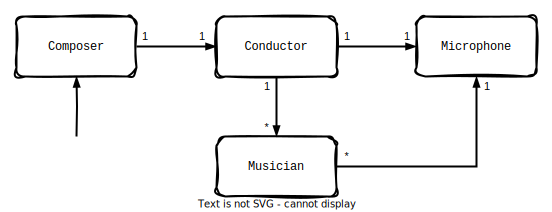

<style>
    code {
        line-height: 1.4;
    }
</style>

<!--
footer: " "
 -->

<!--
paginate: true
 -->

<!--
_footer: ''
_paginate: false
 -->

<!-- _class: lead -->

# More Actors

<div style="margin-top: 30px; margin-bottom: 30px">
    
</div>

### with Tokio


---

<!-- header: ' ' -->

<iframe width="100%" height="90%" src="https://ryhl.io/blog/actors-with-tokio/">
</iframe>

[ryhl.io/blog/actors-with-tokio](https://ryhl.io/blog/actors-with-tokio) (2021)

---

<iframe width="100%" height="90%" src="https://barafael.github.io/posts/more-actors-with-tokio">
</iframe>

[barafael.github.io/posts/more-actors-with-tokio](https://barafael.github.io/posts/more-actors-with-tokio) (2025)

---

### Actor: (my) Street Definition

<style scoped>
div.twocols {
  margin-top: 35px;
  column-count: 2;
}
div.twocols p:first-child,
div.twocols h1:first-child,
div.twocols h2:first-child,
div.twocols ul:first-child,
div.twocols ul li:first-child,
div.twocols ul li p:first-child {
  margin-top: 0 !important;
}
div.twocols p.break {
  break-before: column;
  margin-top: 0;
}
</style>

<div class="twocols">

* Autonomous unit
  isolates state/process
* Communicates with others
  via message passing (channels)
* Channel kinds outline system topology

<p class="break"></p>



</div>

Inspired by Alan Kay [on Quora][quora], the real one had [similar ideas][c2].

[quora]: https://www.quora.com/profile/Rafael-Bachmann-2/https-www-quora-com-What-does-Alan-Kay-mean-when-he-said-OOP-to-me-means-only-messaging-local-retention-and-protection
[c2]: https://wiki.c2.com/?AlanKaysDefinitionOfObjectOriented

---

### Architecture

* Birds-eye-view:
  complex but manageable
* Only actors and channels!
* Fun and useful to follow messages along channels.

[Protohackers Exercise 6 :arrow_right:](https://github.com/barafael/protohackers/tree/main/speedd)


<h4 align="center">Architecture is concerned with distributing responsibility</h4>

---

### An Actor should _be_ its data

Adapted from [Alices original example](https://play.rust-lang.org/?version=stable&mode=debug&edition=2018&gist=1e60fb476843fb130db9034e8ead210c):

````rust
#[derive(Debug, PartialEq, Eq)]
pub struct UniqueIdService {
    next_id: u32,
}
````

No  runtime resources (sockets, channel handles, etc.) here!
They _should_ belong to the actor **event loop** future.

<h3 align="center">Responsibility is Ownership</h3>

---

### The Core Idea is _messaging_

<style scoped>
table {
    width: 100%;
}
table, tbody, tr, th, td {
    background-color: rgba(0, 0, 0, 0.0) !important;
    border-width: 0px;
}
</style>
<table>
<tr>
<td>

* `enum` is perfect for this
* Type of actual actor is _erased_
* Mocking is not required

```rust
type Handle = mpsc::Sender<Message>;
```

</td>
<td style="width: 450px;" >

[Message](https://github.com/barafael/protohackers/blob/02966f7e913b545d81fb521913fa09cb05e6f550/speedd_codecs/src/client/mod.rs#L8-L14) definition:
```rust
#[derive(...)]
pub enum Message {
    Plate(PlateRecord),
    WantHeartbeat(Duration),
    IAmCamera(Camera),
    IAmDispatcher(Vec<u16>),
}
```

</td>
</tr>
</table>

<h3 align="center">Channels are a tool for transferring ownership</h3>

---

### Graceful shutdown

An actor should shut down when its primary means of communication goes away:

- Socket closes
- Channel becomes empty and there are no more senders
- Timeout occurs

When an actor exits, it drops its handles toward other actors - signaling them to exit, too.

---

### Is Rust OOP or not?

<style scoped>
{
  font-size: 32px
}
</style>


> OOP to me means only messaging, local retention and protection and hiding of state-process, and extreme late-binding of all things.

> You could be dumb enough to use these ideas to simulate older, more fragile, less scalable ideas — like “procedures and data” — but who would be so bound to the past to make that enormous blunder?
>
> — <cite>Alan Kay</cite>

**Maybe Rust + actors is OOOP (original object oriented programming).**

---

### Questions?

<!--
_paginate: false
 -->

<iframe style="margin-top:5%" width="100%" height="80%" src="https://play.rust-lang.org/?version=stable&mode=debug&edition=2021&code=fn+main%28%29+%7B%7D%0A">
</iframe>

.jpeg)

---


---

### Aside: Deterministic [Unit Tests](https://play.rust-lang.org/?version=stable&mode=debug&edition=2021&gist=bb316eb8bf6ab51602bfaedb2a841e70)

Playbook:
Construct Data :arrow_right: Enqueue Messages :arrow_right: **drop sender** :arrow_right:
Run event loop to completion :arrow_right: assert on results

* Avoid spawning.
* Avoid defining actor mocks - channels suffice.
* Avoid **at all cost** having to wait 1s to reach a state :shaking_face:.

Use the type system to inject resources (`Stream`, `AsyncRead`, etc.).
**System becomes protocol-agnostic**.

---

### The Event Loop

<style scoped>
{
  font-size: 34px
}
</style>

`async fn` which consumes `self` and runtime resources.

````rust
impl UniqueIdService {
    pub async fn event_loop(mut self, mut rx: mpsc::Receiver<Message>) -> Self {
        loop {
            select! {
                ...
            }
        }
    }
````

[Loop-select is a real superpower](https://barafael.github.io/posts/stop-worrying-and-learn-to-loop-select/).

---

### `event_loop` returns `Self` considered :ok_hand:

Read the blog post for details :shrug:

Advantages:

* Tests: can assert on the guts.
* Shutdown: can act on leftovers.
* Restart: can inject in fresh instance.
* Distributed actors: can move data elsewhere and restart.
